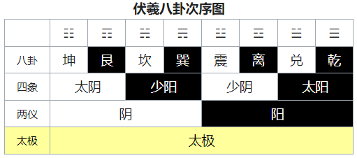
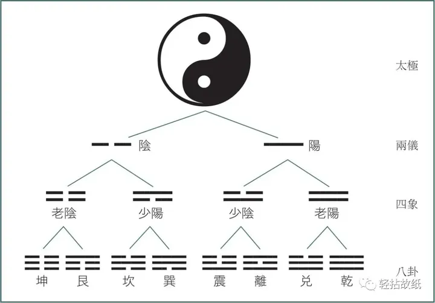
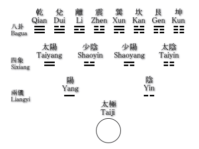
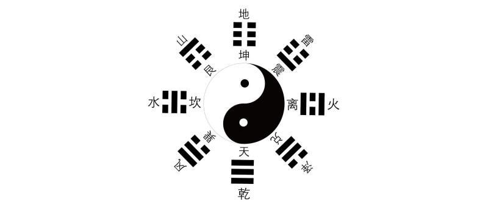
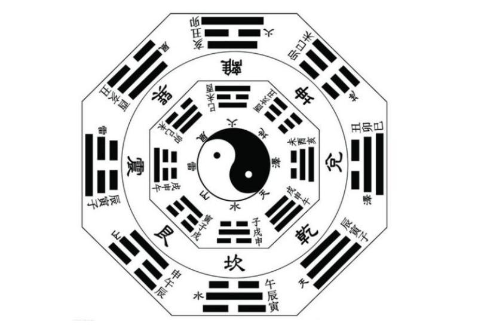
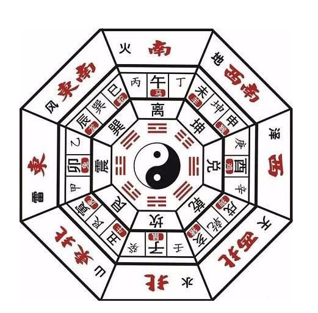
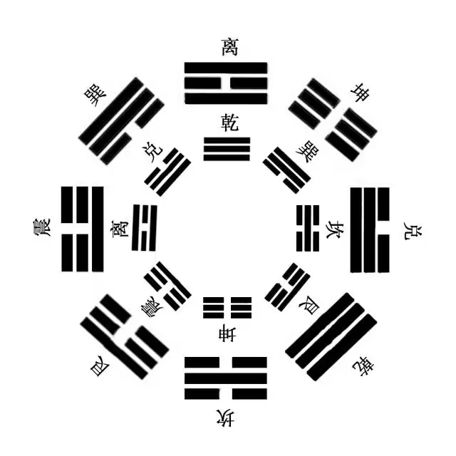
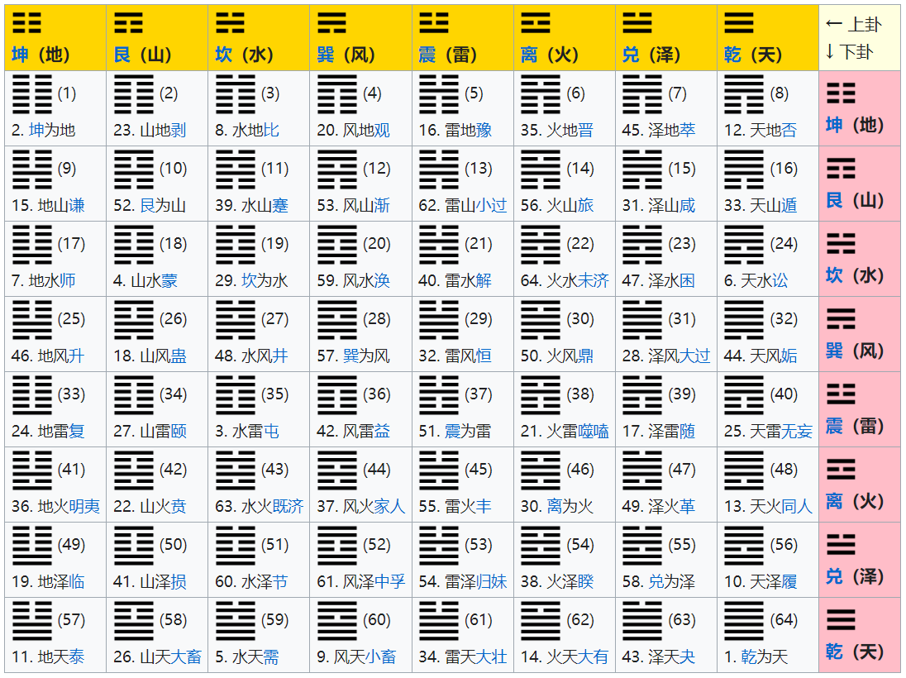

# 爻
易经的内容以"卦"组成,共有六十四卦.每一卦由六层组成,每一层称为"爻yáo".
每一爻以一条长的横线"—"代表阳,称为"阳爻"；或以两条断开的横线"--"代表阴,称为"阴爻".
从最底层数起,总共有六爻,而六爻以不同的阴、阳配搭,形成六十四种不同的组合.
示例图

# 卦
六爻可以分为上半部分和下半部分,每一部分称为一个单卦.六个"爻"以不同的阴、阳配搭,形成多种不同的组合.
六爻由下而上解最下为：《初、二、三、四、五及上》,由三爻所生的卦"由上而下"为之"上卦"或"外卦"、在下方为之"下卦"或"内卦".
# 极
太极：代表一,传统的太极图（☯）代表了阴阳互补；
两仪：一分为二,分开了阴和阳,即是两仪；
四象：二分为四,即是四象：太阳、少阳、少阴、太阴；
八卦：四分为八,即是八卦：乾、兑、离、震、巽、坎、艮、坤；
六十四卦：两个八卦相叠,即成八八六十四卦.
示例图

# 八卦
## 组成
```
乾（☰）、
坎（☵）、
艮（☶）、
震（☳）、
巽（☴）、
离（☲）、
坤（☷）、
兑（☱）、
```
### 结构图

## 方位
### 上八卦
先天八卦。先天八卦讲对峙，即把八卦代表的天地风雷，山泽水火八类物象分为四组，以说明它的阴阳对峙关系。
先天八卦图乾卦在上，坤卦在下，代表天在上，地在下。其他卦象则表示天地万物在天地之间循环往复。
### 下八卦
后天八卦。后天八卦讲流行，形容周期循环，如水流行，用以表示阴阳的依存与互根，五行的母子相生。后天图是从四时的推移，万物的生长收藏得出的规律。
后天八卦的描述为：帝出乎震。齐乎巽。相见乎离。致役乎坤。说言乎兑。战乎乾。劳乎坎。成言乎艮。后天不以阴阳变化为基础，而是配以五行学说进行的配比排列。用震代表春天（东方），离代表夏天（南方），兑代表秋天（西方），坎代表冬天（北方）为四正位，因为震代表雷，春雷乍响，天下春开；离火代表炎热，草木返青，欣欣向荣之象；兑为泽象，代表雨季来临地上坑坑洼洼，沟渠有积水了；坎为水，阴气盛极，代表黯淡阴冷之象……其他四偏位依次类推。

## 示例图






# 六十四卦
伏羲先天六十四卦〈方圆四分四层图〉排列方位图表
表中卦象符号旁括号的是伏羲先天六十四卦卦象演化序号，符号下方的是周易后天六十四卦《易经》卦象序号
## 示例图

## 上下经
### 上经三十卦
```
01. 乾　 ䷀    02. 坤　 ䷁    03. 屯　 ䷂    04. 蒙　 ䷃    05. 需　 ䷄    06. 讼　 ䷅
07. 师　 ䷆    08. 比　 ䷇    09. 小畜 ䷈    10. 履　 ䷉    11. 泰　 ䷊    12. 否　 ䷋
13. 同人 ䷌    14. 大有 ䷍    15. 谦　 ䷎    16. 豫　 ䷏    17. 随　 ䷐    18. 蛊　 ䷑
19. 临　 ䷒    20. 观　 ䷓    21. 噬嗑 ䷔    22. 贲　 ䷕    23. 剥　 ䷖    24. 复　 ䷗
25. 无妄 ䷘    26. 大畜 ䷙    27. 颐　 ䷚    28. 大过 ䷛    29. 坎　 ䷜    30. 离　 ䷝
```
### 下经三十卦
```
31. 咸　 ䷞    32. 恒　 ䷟    33. 遁　 ䷠    34. 大壮 ䷡    35. 晋　 ䷢    36. 明夷 ䷣
37. 家人 ䷤    38. 睽　 ䷥    39. 蹇　 ䷦    40. 解　 ䷧    41. 损　 ䷨    42. 益　 ䷩
43. 夬　 ䷪    44. 姤　 ䷫    45. 萃　 ䷬    46. 升　 ䷭    47. 困　 ䷮    48. 井　 ䷯
49. 革　 ䷰    50. 鼎　 ䷱    51. 震　 ䷲    52. 艮　 ䷳    53. 渐　 ䷴    54. 归妹 ䷵
55. 丰　 ䷶    56. 旅　 ䷷    57. 巽　 ䷸    58. 兑　 ䷹    59. 涣　 ䷺    60. 节　 ䷻
61. 中孚 ䷼    62. 小过 ䷽    63. 既济 ䷾    64. 未济 ䷿
```