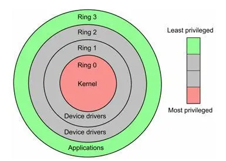

# 内核空间与用户空间
为了保护操作系统安全,操作系统按照特权等级将将虚拟空间划分为两个部分,内核空间与用户空间.<br>
内核空间（Ring 0）是操作系统内核访问的区域,具有最高权限,可以直接访问所有资源.<br>
用户空间（Ring 3）是普通应用程序可访问的内存区域,只能访问受限资源,不能直接访问内存等硬件设备,必须通过系统调用陷入到内核中,才能访问这些特权资源.<br>
只能访问用户空间也就是运行在Ring 3上的程序我们称为用户程序,而运行在Ring 0上的程序我们称为内核程序.<br>

# 内核态与用户态
用户程序不能访问内核空间,如果想要调用内核程序进行IO操作,必须从用户态切换为内核态,等到内核处理完之后再切换为用户态.
## 内核态
处理器处于特权级最高的（Ring 0）内核代码中执行.当进程处于内核态时,执行的内核代码会使用当前进程的内核栈.每个进程都有自己的内核栈. <br>
## 用户态
此时处理器在特权级最低的（Ring 3）用户代码中运行.当正在执行用户程序而突然被中断程序中断时,此时用户程序也可以象征性地称为处于进程的内核态.因为中断处理程序将使用当前进程的内核栈. <br>
## IO 操作状态切换
用户程序进行IO操作时需要进行两次状态切换
```
用户态->内核态->用户态
```
### 具体流程: <br>
1.用户态程序将一些数据值放在寄存器中,或者使用参数创建一个堆栈(stack frame),以此表明需要操作系统提供的服务. <br>
2.用户态程序执行陷阱指令. <br>
3.CPU切换到内核态,并跳到位于内存指定位置的指令,这些指令是操作系统的一部分, 他们具有内存保护,不可被用户态程序访问. <br>
4.这些指令称之为陷阱(trap)或者系统调用处理器(system call handler),他们会读取程序放入内存的数据参数,并执行程序请求的服务. <br>
5.系统调用完成后,操作系统会重置CPU为用户态并返回系统调用的结果. <br>