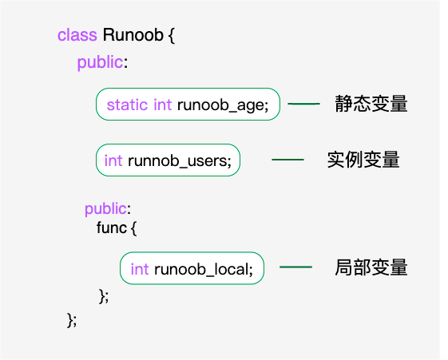
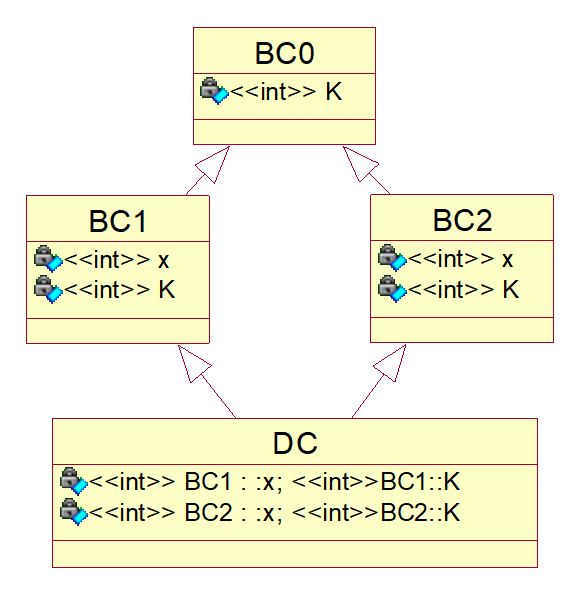

# 概述
C++ 在 C 语言的基础上增加了面向对象编程,C++ 支持面向对象程序设计.类是 C++ 的核心特性,通常被称为用户定义的类型.<br>
类用于指定对象的形式,是一种用户自定义的数据类型,它是一种封装了数据和函数的组合.<br>
类中的数据称为成员变量,函数称为成员函数.类可以被看作是一种模板,可以用来创建具有相同属性和行为的多个对象.<br>
# 类定义
## 格式
### 格式一
```cpp
class className{
    Assess specifiers: // 访问修饰符 private/public/protected
            Date members/variables; //变量
            Member funcctions(){} // 方法
    public: // 访问修饰符 private/public/protected
            Date members/variables; //变量
            Member funcctions(){} // 方法
    protected: // 访问修饰符 private/public/protected
            Date members/variables; //变量
            Member funcctions(){} // 方法
    private: // 访问修饰符 private/public/protected
            Date members/variables; //变量
            Member funcctions(){} // 方法
};
```
### 格式二
```cpp
class A{
    public:
        A(){
            // 无参构造
        }; 
        A(int a,int b){
           // 有参构造                    
        };
}

// 可选创建对象方式
A a;
A a(1,2);
A a=A();
A a=A(1,2);
```
## 类内定义
```cpp
class A
{
public:
    A(void);
    virtual ~A(void);
    int test(){return 1;};
    int test1();
};
```
## 同文件类外定义
```cpp
class Box
{
   public:
      double length;   // 长度
      double breadth;  // 宽度
      double height;   // 高度
      // 成员函数声明
      double get(void);
      void set( double len, double bre, double hei );
};
// 成员函数定义
double Box::get(void)
{
    return length * breadth * height;
}
 
void Box::set( double len, double bre, double hei)
{
    length = len;
    breadth = bre;
    height = hei;
}
```
## 不同文件类外定义
### Yase.h
```cpp
class Yase
{
public:
    void f1();//1技能
    void f2();//2技能
    void f3();    //3技能
    int getHp();
    void setHp(int _hp)//这里只举hp的例子
private:
    int hp;//生命
    int wg;//物攻
    int fq;//法强
    int wk;//物抗
    int fk;//法抗
    int mj;//敏捷
};
```
### Yase.cpp
```cpp
#include "Yase.h"
#include <iostream>
using namespace std;

void Yase::f1(){
    cout <<"Yase use 1 skill";
}

void Yase::f2(){
    cout <<"Yase use 2 skill";
}

void Yase::f3(){
    cout << "Yase use 3 skill";
} 

int Yase::getHp(){
    return hp;
}

void Yase::setHp(int _hp){
    hp = _hp;
}
```
# 创建对象
## 方法一
隐式调用
在进程虚拟地址空间中的栈中分配内存
```cpp
A a(1);  //栈中分配
```
## 方法二
显式调用
在进程虚拟地址空间中的栈中分配内存
```cpp
A b = A(1);  //栈中分配
```
## 方法三
在堆中分配了内存,而栈中内存的分配和释放是由系统管理,而堆中内存的分配和释放必须由程序员手动释放.
```cpp
A* c = new A(1);  //堆中分配 c指向了A类实例的起始地址
```
## 注意事项
```cpp
new创建类对象需要指针接收,一处初始化,多处使用 
new创建类对象使用完需delete销毁
new创建对象直接使用堆空间,而局部不用new定义类对象则使用栈空间
new对象指针用途广泛,比如作为函数返回值、函数参数等
频繁调用场合并不适合new,就像new申请和释放内存一样
栈的大小远小于堆的大
栈是机器系统提供的数据结构,计算机会在底层对栈提供支持: 分配专门的寄存器存放栈的地址,压栈出栈都有专门的指令执行,这就决定了栈的效率 比较高.堆则是C/C++函数库提供的,它的机制是很复杂的,例如为了分配一块内存,库函数会按照一定的算法(具体的算法可以参考数据结构/操作系统)在 堆内存中搜索可用的足够大小的空间,如果没有足够大小的空间(可能是由于内存碎片太多),就有可能调用系统功能去增加程序数据段的内存空间,这样就有机会 分 到足够大小的内存,然后进行返回.显然,堆的效率比栈要低得多.
```
# 构造函数
对象实例化时调用. <br>
类的构造函数是类的一种特殊的成员函数,它会在每次创建类的新对象时执行.<br>
构造函数的名称与类的名称是完全相同的,并且不会返回任何类型,也不会返回 void.<br>
构造函数可用于为某些成员变量设置初始值.<br>
## 示例
```cpp
#include <iostream>

using namespace std;
 
class Line
{
   public:
      void setLength( double len );
      double getLength( void );
      Line();  // 无参数构造函数
      Line(double len);  // 这是构造函数 
   private:
      double length;
};
 
// 成员函数定义,包括构造函数

Line::Line(void)
{
    cout << "Object is being created" << endl;
}
 
void Line::setLength( double len )
{
    length = len;
}
 
double Line::getLength( void )
{
    return length;
}

// 主函数
int main( )
{
   Line line;
   // 或
   Line line(10.0);
   // 设置长度
   line.setLength(6.0); 
   cout << "Length of line : " << line.getLength() <<endl; 
   return 0;
}
```
# 析构函数
类的析构函数是类的一种特殊的成员函数,它会在每次删除所创建的对象时执行.<br>
析构函数的名称与类的名称是完全相同的,只是在前面加了个波浪号(~)作为前缀,它不会返回任何值,也不能带有任何参数.<br>
析构函数有助于在跳出程序(比如关闭文件、释放内存等)前释放资源.<br>
## 示例
```cpp
#include <iostream>

using namespace std;
 
class Line
{
   public:
      void setLength( double len );
      double getLength( void );
      Line();   // 这是构造函数声明
      ~Line();  // 这是析构函数声明
   private:
      double length;
};
 
// 成员函数定义,包括构造函数
Line::Line(void)
{
    cout << "Object is being created" << endl;
}
Line::~Line(void)
{
    cout << "Object is being deleted" << endl;
}
 
void Line::setLength( double len )
{
    length = len;
}
 
double Line::getLength( void )
{
    return length;
}

// 主函数
int main( )
{
   Line line;
   // 设置长度
   line.setLength(6.0); 
   cout << "Length of line : " << line.getLength() <<endl;
   return 0;
}
```
# 拷贝构造函数
拷贝构造函数,又称复制构造函数,是一种特殊的构造函数,它由编译器调用来完成一些基于同一类的其他对象的构造及初始化. <br>
拷贝构造函数从来不显式调用,而是由编译器隐式地调用. <br>
拷贝构造函数是一种特殊的构造函数;<br>
拷贝构造函数的含义:  以一个对象为蓝本,来构造另一个对象;<br>
它是构造函数,所以函数名是类名、没有返回值.<br>
它是特殊的构造函数: 参数形式是固定的.<br>
## 格式
```cpp
class Object
{
public:
    Object( const Object& other );
};
```
## 三种场景
### 定义对象
```cpp
Object a;
Object b(a);  // 或写成 Object b = a;
```
### 动态创建对象
```cpp
Object a;
Object* p = new Object(a);
```
### 函数的传值调用
```cpp
void Test(Object obj);
```
# 有元函数
友元函数可以访问类的 private 和 protected 成员. <br>
类的友元函数是定义在类外部,但有权访问类的所有私有(private)成员和保护(protected)成员. <br>
尽管友元函数的原型有在类的定义中出现过,但是友元函数并不是成员函数. <br>
友元可以是一个函数,该函数被称为友元函数；<br>
友元也可以是一个类,该类被称为友元类,在这种情况下,整个类及其所有成员都是友元. <br>
不是任何类的成员,可以直接访问该类的任何成员<br>
## 示例
```cpp
#include <iostream>
 
using namespace std;
 
class Box
{
   double width;
public:
   friend void printWidth( Box box );
   void setWidth( double wid );
};
 
// 成员函数定义
void Box::setWidth( double wid )
{
    width = wid;
}
 
// 请注意: printWidth() 不是任何类的成员函数
void printWidth( Box box )
{
   /* 因为 printWidth() 是 Box 的友元,它可以直接访问该类的任何成员 */
   cout << "Width of box : " << box.width <<endl;
}
 
// 主函数
int main( )
{
   Box box;
   // 使用成员函数设置宽度
   box.setWidth(10.0);
   // 使用友元函数输出宽度
   printWidth( box );
   return 0;
}
```
# 内联函数
C++ 内联函数是通常与类一起使用. <br>
如果一个函数是内联的,那么在编译时,编译器会把该函数的代码副本放置在每个调用该函数的地方. <br>
对内联函数进行任何修改,都需要重新编译函数的所有客户端,因为编译器需要重新更换一次所有的代码,否则将会继续使用旧的函数. <br>
如果想把一个函数定义为内联函数,则需要在函数名前面放置关键字 inline,在调用函数之前需要对函数进行定义. <br>
如果已定义的函数多于一行,编译器会忽略 inline 限定符. <br>
在类定义中的定义的函数都是内联函数,即使没有使用 inline 说明符. <br>
## 示例
```cpp
#include <iostream>
 
using namespace std;

inline int Max(int x, int y)
{
   return (x > y)? x : y;
}

// 程序的主函数
int main( )
{
   cout << "Max (20,10): " << Max(20,10) << endl;
   cout << "Max (0,200): " << Max(0,200) << endl;
   cout << "Max (100,1010): " << Max(100,1010) << endl;
   return 0;
}
```
# this 关键字
在 C++ 中,this 指针是一个特殊的指针,它指向当前对象的实例. <br>
在 C++ 中,每一个对象都能通过 this 指针来访问自己的地址. <br>
this是一个隐藏的指针,可以在类的成员函数中使用,它可以用来指向调用对象. <br>
当一个对象的成员函数被调用时,编译器会隐式地传递该对象的地址作为 this 指针. <br>
友元函数没有 this 指针,因为友元不是类的成员,只有成员函数才有 this 指针. <br>
## 示例
```cpp
#include <iostream>

class MyClass {
private:
    int value;
 
public:
    void setValue(int value) {
        this->value = value;
    }
 
    void printValue() {
        std::cout << "Value: " << this->value << std::endl;
    }
};
 
int main() {
    MyClass obj;
    obj.setValue(42);
    obj.printValue();
 
    return 0;
}
```
# 类指针
一个指向 C++ 类的指针与指向结构的指针类似,访问指向类的指针的成员,需要使用成员访问运算符 ->,就像访问指向结构的指针一样.<br>
与所有的指针一样,您必须在使用指针之前,对指针进行初始化.<br>
## 示例
```cpp
#include <iostream>
 
using namespace std;

class Box
{
   public:
      // 构造函数定义
      Box(double l=2.0, double b=2.0, double h=2.0)
      {
         cout <<"Constructor called." << endl;
         length = l;
         breadth = b;
         height = h;
      }
      double Volume()
      {
         return length * breadth * height;
      }
   private:
      double length;     // Length of a box
      double breadth;    // Breadth of a box
      double height;     // Height of a box
};

int main(void)
{
   Box Box1(3.3, 1.2, 1.5);    // Declare box1
   Box Box2(8.5, 6.0, 2.0);    // Declare box2
   Box *ptrBox;                // Declare pointer to a class.
   // 保存第一个对象的地址
   ptrBox = &Box1;
   // 现在尝试使用成员访问运算符来访问成员
   cout << "Volume of Box1: " << ptrBox->Volume() << endl;
   // 保存第二个对象的地址
   ptrBox = &Box2
   // 现在尝试使用成员访问运算符来访问成员
   cout << "Volume of Box2: " << ptrBox->Volume() << endl;
   return 0;
}
```
# 静态成员变量
可以使用 static 关键字来把类成员定义为静态的.<br>
当我们声明类的成员为静态时,这意味着无论创建多少个类的对象,静态成员都只有一个副本.<br>
静态成员在类的所有对象中是共享的.<br>
如果不存在其他的初始化语句,在创建第一个对象时,所有的静态数据都会被初始化为零.<br>
我们不能把静态成员的初始化放置在类的定义中,但是可以在类的外部通过使用范围解析运算符 :: 来重新声明静态变量从而对它进行初始化,如下面的实例所示.<br>
## 示意图

## 示例
```cpp
#include <iostream>

using namespace std;
 
class Box
{
   public:
      static int objectCount;
      // 构造函数定义
      Box(double l=2.0, double b=2.0, double h=2.0)
      {
         cout <<"Constructor called." << endl;
         length = l;
         breadth = b;
         height = h;
         // 每次创建对象时增加 1
         objectCount++;
      }
      double Volume()
      {
         return length * breadth * height;
      }
   private:
      double length;     // 长度
      double breadth;    // 宽度
      double height;     // 高度

};
 
// 初始化类 Box 的静态成员
int Box::objectCount = 0;
 
int main(void)
{
   Box Box1(3.3, 1.2, 1.5);    // 声明 box1
   Box Box2(8.5, 6.0, 2.0);    // 声明 box2
   // 输出对象的总数
   cout << "Total objects: " << Box::objectCount << endl;
   return 0;
}
```
# 静态成员函数
如果把函数成员声明为静态的,就可以把函数与类的任何特定对象独立开来.静态成员函数即使在类对象不存在的情况下也能被调用,静态函数只要使用类名加范围解析运算符.
静态成员函数只能访问静态成员数据、其他静态成员函数和类外部的其他函数.
静态成员函数有一个类范围,他们不能访问类的 this 指针.您可以使用静态成员函数来判断类的某些对象是否已被创建.
## 访问格式
```cpp
类 :: 函数
```
## 静态成员函数与普通成员函数的区别
```
静态成员函数没有 this 指针,只能访问静态成员(包括静态成员变量和静态成员函数).
普通成员函数有 this 指针,可以访问类中的任意成员；而静态成员函数没有 this 指针.
```
## 示例
```cpp
#include <iostream>

using namespace std;
 
class Box
{
   public:
      static int objectCount;
      // 构造函数定义
      Box(double l=2.0, double b=2.0, double h=2.0)
      {
         cout <<"Constructor called." << endl;
         length = l;
         breadth = b;
         height = h;
         // 每次创建对象时增加 1
         objectCount++;
      }
      double Volume()
      {
         return length * breadth * height;
      }
      static int getCount()
      {
         return objectCount;
      }
   private:
      double length;     // 长度
      double breadth;    // 宽度
      double height;     // 高度

};
 
// 初始化类 Box 的静态成员
int Box::objectCount = 0;
 
int main(void)
{
   // 在创建对象之前输出对象的总数
   cout << "Inital Stage Count: " << Box::getCount() << endl;
   Box Box1(3.3, 1.2, 1.5);    // 声明 box1
   Box Box2(8.5, 6.0, 2.0);    // 声明 box2
   // 在创建对象之后输出对象的总数
   cout << "Final Stage Count: " << Box::getCount() << endl;
   return 0;
}
```
# 虚函数
推迟指针指向的决定.<br>
父类型别的指针指向其子类的实例,并调用子类实例的实现.<br>
虚函数是应在派生类中重新定义的成员函数. <br>
当使用指针或对基类的引用来引用派生的类对象时,可以为该对象调用虚函数并执行该函数的派生类版本.<br>
虚函数确保为该对象调用正确的函数,这与用于进行函数调用的表达式无关.<br>
虚函数 是在基类中使用关键字 virtual 声明的函数.<br>
在派生类中重新定义基类中定义的虚函数时,会告诉编译器不要静态链接到该函数.<br>
我们想要的是在程序中任意点可以根据所调用的对象类型来选择调用的函数,这种操作被称为动态链接,或后期绑定.<br>
虚函数使用的其核心目的是通过基类访问派生类定义的函数.<br>
所谓虚函数就是在基类定义一个未实现的函数名,为了提高程序的可读性,建议后代中虚函数都加上virtual关键字.<br>
## 原理
virtual 无论是函数,还是类继承中,他的真实功能就是推迟指针指向的决定.
将在编译期的决定推迟到运行时决定,于是就有了多态的实现,多态的原理便是运行时的动态绑定.
虚基类的继承是的类变量的指针可以推迟指向,而解决子类的二义性的问题以及存储浪费问题.
```
编译期 : 虚函数的函数名符号指向是空的
运行期 : 虚函数的指针指向对象域,而不是类域
```
## 示例
```cpp
class A {
public:
    A() {};
    virtual void f1(){
        std::cout << "class A" << std::endl;
    };
};

class B : public A {
public:
    int a;
    int b;
    B() {};
    B(int aa, int bb) {
        a = aa;
        b = bb;
    }
    void f1() {
        std::cout << "class B" << std::endl;
    }
};


// 使用
A *a = new A();
B b;
a=&b;
a->f1(); // 输出 : class B
std::cout << "Hello, World123!" << std::endl;
```
# 继承
## 概述
存在多继承的类层次图是一个图(graph).
只有单继承的类层次图是一个树(tree).
## 格式
```cpp
class 子类: public 父类{
    // ......
}
```
## 单继承
```cpp
#include <iostream>

using namespace std;
 
// 基类
class Shape 
{
   public:
      void setWidth(int w)
      {
         width = w;
      }
      void setHeight(int h)
      {
         height = h;
      }
   protected:
      int width;
      int height;
};
 
// 派生类
class Rectangle: public Shape
{
   public:
      int getArea()
      { 
         return (width * height); 
      }
};
 
int main(void)
{
   Rectangle Rect;
   Rect.setWidth(5);
   Rect.setHeight(7);
   // 输出对象的面积
   cout << "Total area: " << Rect.getArea() << endl;
   return 0;
}
```
## 多重继承
```cpp
class BC0
{
public:
    int K;
};
class BC1 : public BC0
{
public:
    int x;
};
class BC2 : public BC0
{
public:
    int x;
};
class  DC : public BC1, public BC2{
};
```
### 示意图

## 继承类型
当一个类派生自基类,该基类可以被继承为 public、protected 或 private 几种类型.继承类型是通过上面讲解的访问修饰符 access-specifier 来指定的.<br>
我们几乎不使用 protected 或 private 继承,通常使用 public 继承.当使用不同类型的继承时,遵循以下几个规则: <br>
```
公有继承(public): 当一个类派生自公有基类时,基类的公有成员也是派生类的公有成员,基类的保护成员也是派生类的保护成员,基类的私有成员不能直接被派生类访问,但是可以通过调用基类的公有和保护成员来访问.
保护继承(protected):  当一个类派生自保护基类时,基类的公有和保护成员将成为派生类的保护成员.
私有继承(private): 当一个类派生自私有基类时,基类的公有和保护成员将成为派生类的私有成员.
```
# 多态
概述
多态按字面的意思就是多种形态.当类之间存在层次结构,并且类之间是通过继承关联时,就会用到多态.<br>
C++ 多态意味着调用成员函数时,会根据调用函数的对象的类型来执行不同的函数.<br>
C++中的虚函数的作用主要是实现了多态的机制.<br>
简而言之就是用父类型别的指针指向其子类的实例,然后通过父类的指针调用实际子类的成员函数.
这种技术可以让父类的指针有"多种形态".<br>
## 示例
```cpp
#include <iostream> 

using namespace std;
 
class Shape {
   protected:
      int width, height;
   public:
      Shape( int a=0, int b=0)
      {
         width = a;
         height = b;
      }
      int area()
      {
         cout << "Parent class area :" <<endl;
         return 0;
      }
};
class Rectangle: public Shape{
   public:
      Rectangle( int a=0, int b=0):Shape(a, b) { }
      int area ()
      { 
         cout << "Rectangle class area :" <<endl;
         return (width * height); 
      }
};
class Triangle: public Shape{
   public:
      Triangle( int a=0, int b=0):Shape(a, b) { }
      int area ()
      { 
         cout << "Triangle class area :" <<endl;
         return (width * height / 2); 
      }
};
// 程序的主函数

int main( )
{
   Shape *shape;
   Rectangle rec(10,7);
   Triangle  tri(10,5);
 
   // 存储矩形的地址

   shape = &rec;
   // 调用矩形的求面积函数 area

   shape->area();
 
   // 存储三角形的地址

   shape = &tri;
   // 调用三角形的求面积函数 area

   shape->area();
   
   return 0;
}
```