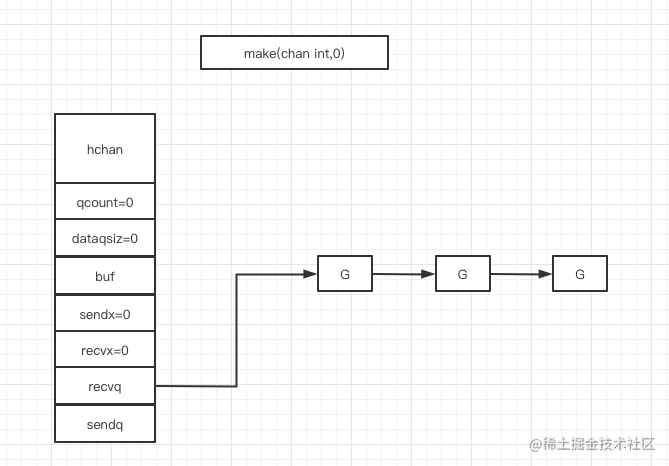
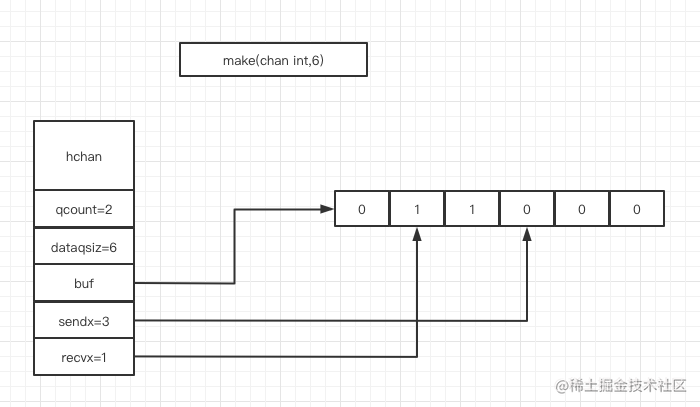
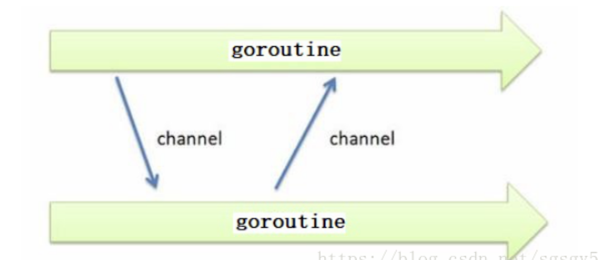

# 概述
管道是类型相关的,即一个管道只能传递一种类型的值. 
管道中的数据是先进先出的. 
# 管道数据结构
```go
// 源码所在路径
// src/runtime/chan.go:hchan
type hchan struct {
  qcount   uint           // 当前队列中剩余的元素个数
  dataqsiz uint           // 环形队列长度，即可以存放的元素个数
  buf      unsafe.Pointer // 环形队列的指针
  elemsize uint16   //每个元素的大小
  closed   uint32   //标识关闭状态
  elemtype *_type // 每个元素的类型
  sendx    uint   // 队列下标，表示元素写入时存放到队列中的位置
  recvx    uint   // 队列下标。表示下一个被读取的元素在队列中的位置
  recvq    waitq  // 等待读消息的协程队列
  sendq    waitq  // 等待写消息的协程队列
​
  // lock protects all fields in hchan, as well as several
  // fields in sudogs blocked on this channel.
  //
  // Do not change another G's status while holding this lock
  // (in particular, do not ready a G), as this can deadlock
  // with stack shrinking.
  lock mutex  //互斥锁，chan不允许并发读写
}
```
# 类型信息
1. 一个管道只能传递一种类型的值，类型信息存储在hchan数据结构中。
2. elemtype 代表类型，用于在数据传递过程中赋值
3. elemsize 代表类型大小，用于在buf中定位元素的位置
4. 如果需要想管道中传递任意类型的数据，则可以使用interface{}类型。
# 等待队列
从管道读取数据时，如果管道缓冲区为空或者没有缓冲区，则当前协程会被阻塞，并加入recvq队列。<br>
向管道写入数据时，如果管道没有缓冲区或者缓冲区已满，则当前协程会被阻塞，并加入sendq队列。<br>
图示: <br>
 <br>
# 环形队列
chan内部实现了一个环形队列作为其缓冲区，队列的长度是在创建chan 时指定的。
图示:
 <br>
## 参数
1. dataqsiz ：表示了队列长度为6，即可缓存6个数据
2. buf ：指向了队列的内存
3. qcount ：表示队列中还有两个元素
4. sendx ：表示后续写入的数据存储的位置，取值为[0:6)
5. recvx ：表示从该位置读取数据，取值为[0:6)
使用数组数显队列是比较常见的操作，sendx和recvx分别表示队尾和队首，sendx表示数据写入的位置，recvx表示数据读取的位置。
# 初始化
声明和初始化管道的方式主要有以下两种:
1. 变量声明
2. 使用内置函数
## 变量声明
这种方式声明的管道,值为nil. 每个管道只能存储一种类型的数据
```go
//声明管道
var ch chan int
```
## 使用内置函数 
使用内置函数make() 可以创建无缓冲管道和带缓冲管道
```go
//无缓冲管道
ch1:=make(chan string) 
//带缓冲管道
ch2:=make(chan string,5)  
```
# 管道操作
## 操作符
操作符  "<-"  表示数据流向,管道在左表示向管道写入数据,管道在右表示从管道读取数据
```go
ch := make(chan int,10)
//数据写入管道
ch <- 1 
//从管道中读取数据
d := <- ch 
fmt.Println(d)
```
默认的管道是双向可读写,管道在函数间传递时可以使用操作符限制管道的读写,如下所示
```go
func ChanParamRW(ch chan int){
  //管道双向可读写
}
func ChanParamRW(ch <-chan int){
  //管道单向只读
}
func ChanParamRW(ch chan<- int){
  //管道单向只写
}
```
## 声明一个双向通道
```go
make(chan int)
chan T 
```
## 只读管道声明
声明一个只能用于接收的通道
```go
make(<-chan int)
<-chan T
```
## 只写管道声明
声明一个只能用于发送的通道
```go
chan<- T 
make(chan<- int)
```
## 声明无缓冲区管道
```go
// 无缓冲区
ch := make(chan int)
```
## 声明缓冲区管道
```go
ch := make(chan int) //初始化一个无缓冲区的int类型通道
ch := make(chan int, 3) //初始化一个容量为3有缓冲区的int类型通道
```
## 管道写入
```go
c <- 1
// 表将v发送到ch中
ch <- v     
```
## 管道读取
```go
// 阻塞，将管道中数据读入变量a
a:=<-c 
// 阻塞，不使用变量接收管道中的数据,读取到任意数据，则放行
<-c
// 表从ch接收一个值
<-ch        
// 表从ch接收一个值并存在新的变量v中
v := <-ch    
// 赋值变量
var v int
// 从ch中接收一个值并保存在v中, 没有=就不会保存的, 易错！！
v = <-ch    
```
## 多管道嵌套使用
```go
func main() {
   c, c2 := make(chan bool), make(chan bool)
   i := 0
   go func(c chan bool) {
      for {
         time.Sleep(time.Duration(2) * time.Second)
         i++
         c <- false
         time.Sleep(time.Duration(2) * time.Second)
         c2 <- true
      }
   }(c)
   if <-c {
      fmt.Println("正确")
   } else {
      fmt.Println("错误")
      if <-c2 {
         fmt.Println("错误中正确")
      }
   }
}
// 输出
错误
错误中正确
```
## 循环使用
```go
func main() {
   c := make(chan int)
   go func(c chan int) {
      for i := 0; i < 10; i++ {
         time.Sleep(time.Duration(2) * time.Second)
         c <- i // 写入
      }
   }(c)

   for i := 0; i < 10; i++ {
      a := <-c // 阻塞，可以保证读写的一致性
      fmt.Println("输出,", a)
   }
}
```
# 数据读写
管道没有缓冲区时,从管道读取数据会堵塞,直到有协程向管道中写入数据. <br>
类似的,写数据也会堵塞,直到有协程从管道读取数据、
管道有缓冲区时但缓冲区没有数据时,读数据会阻塞,直到有写入操作. <br>
类似的,写数据时,如果缓冲区已满,那么也会堵塞,直到有协程从管道中读取数据
对于值为nil的管道,无论读写都会堵塞,而且是永久堵塞. (协程无法释放,此处会出现协程泄漏) <br>
使用内置函数close()可以关闭管道,尝试向关闭的管道写入数据会发生panic,但是关闭的管道依旧可读 <br>
管道读取表达式最多可以给两个变量赋值:
```go
v1 := <-ch
x,ok :=<-ch
```
第一个变量表示读取的数据,第二个变量(bool 类型)表示是否成功读取了数据,需要注意的是,第二个变量不用于表示管道的关闭状态. <br>
第二个变量通常被错误的理解成管道的关闭状态,那是因为它的值确实跟管道的关闭状态有关,更确切的说跟管道缓冲区中是否有数据有关. <br>
一个已关闭的管道有两种情况:
1. 管道缓冲区没有数据. <br>
2. 管道缓冲区还有数据. <br>
对于第一种情况,管道已关闭且缓冲区没有数据,那么管道读取表达式返回的第一个变量为相应类型的零值,第二个变量为false. <br>
对于第二种情况,管道已关闭单缓冲区还有数据,那么管道读取表达式返回的第一个变量为读取到的数据,第二个变量为true. <br>
可以看到,只有管道已关闭且缓冲区中没有数据时,管道读取表达式返回的第二个变量才跟管道的关闭状态一致. <br>
# 缓冲区
Channel的理解
Channel是Go中的一个核心类型,可以把它看成一个管道,通过它并发核心单元就可以发送或者接收数据进行通讯(communication),Channel也可以理解是一个先进先出的队列,通过管道进行通信. 
Golang的Channel,发送一个数据到Channel和从Channel接收一个数据都是原子性的. 
Go的设计思想就是,不要通过共享内存来通信,而是通过通信来共享内存,前者就是传统的加锁,后者就是Channel. 
也就是说,设计Channel的主要目的就是在多任务间传递数据,所以本身就是安全的. 
 <br>
## 带缓冲区和不带缓冲区的区别
1. 缓冲区大小不同
不带缓冲区的chan缓冲区大小是0,带缓冲区的chan缓冲区至少是1
2. 运行方式不同
- 带缓冲区的channel:【同步】<br>
写入阻塞条件:缓冲区满,缓冲区写满就不继续写,阻塞；<br>
取出阻塞条件:缓冲区没有数据,缓冲区没有数据就等待数据写入并读取,阻塞. <br>
- 不带缓冲区的channel:【异步】<br>
写入阻塞条件:同一时间没有另外一个线程对该chan进行读操作；<br>
取出阻塞条件:同一时间没有另外一个线程对该chan进行写操作. <br>
## channel存在3种状态
1. nil:未初始化的状态,只进行了声明,或者手动赋值为nil,nil状态的chan是不能close(panic: close of nil channel)；
2. active:正常的channel,可读或者可写 ；
3. closed:已关闭,千万不要误认为关闭channel后,channel的值是nil,关闭的状态的chan仍然可以读值(取值),但不能写值(会报panic: send on closed channel). 
```go
func main() {
    var a chan int
    fmt.Println(a) // <nil>
    a = make(chan int)
    close(a)
    fmt.Println(a) // 0xc00003e060
}
```
channel可进行3种操作
 <br>
## 总结
1. 发生 panic 的情况有三种:
   - 向一个关闭的 channel 进行写操作；
   - 重复关闭一个 channel；
   - 关闭一个 nil 的 channel. 
2. 发生 阻塞(死锁)的情况:
   - 读、写一个 nil channel.  
## 示例一
```go
package main

import (
   "container/ring"
   "fmt"
   "time"
)

func main() {
   r := ring.New(10)
   cursor := r // 声明一个游标来消费
   fmt.Println(r.Len()) // 打印缓存区大小
   // 缓冲区塞入数据
   go func() {
      for i := 0; i < 100; i++ {
         if r.Value == nil {
            fmt.Println("往缓存区塞入,", i)
            r.Value = i
            r = r.Next()
         } else {
            fmt.Println("缓存区阻塞,等待消费,", r.Value)
         }
         time.Sleep(2 * time.Second)
      }
   }()

   // 消费缓冲区
   for {
      time.Sleep(2 * time.Second)
      if cursor.Value != nil {
         fmt.Println("缓存数据: 消费成功. ", cursor.Value)
         cursor.Value = nil
         cursor = cursor.Next()
      } else {
         fmt.Println("缓存数据: 等待塞入")
      }
   }

}

执行结果
go run main.go
10
往圈里塞入 0
往圈里塞入 1
消费圈: 成功  0
往圈里塞入 2
消费圈: 成功  1
消费圈: 成功  2
往圈里塞入 3
往圈里塞入 4
...
```
## 案例二
```go
package main
 
import (
    "fmt"
    "time"
)
 
func main() {
    // 定义一个channel
    c := make(chan int, 3)
    fmt.Println("len(c) = ", len(c), ", cap(c) = ", cap(c))
    go func() {
        defer fmt.Println("子go程结束")
        for i := 1; i < 4; i++ {
            c <- i
            fmt.Println("子go程正在运行,发送的元素= ", i, "len(c)=", len(c), "cap(c)=", cap(c))
        }
    }()
 
    time.Sleep(2 * time.Second)
    for i := 1; i < 4; i++ {
        num := <-c // 从channel中接收数据并赋值给num
        fmt.Println("接收数据 num = ", num)
    }
    fmt.Println("main结束")
}
```
# 管道函数
1. 双向通道参数
通道有两种类型,无向通道和默认的双向通道. 
```go
func f1(c chan int, x int) {
    fmt.Println(x)
    c <- x
}
```
2. 单向通道参数
只写通道参数
```go
func f2(c chan<- int, x int){
    fmt.Println(x)
    c <- x
}
```
f2() 函数的 chan 关键字右侧有个 <- 符号. 这说明过 c 通道只能用于写数据. 如果 Go 代码试图从一个只读通道(只发通道)读取数据的话,Go 编译器就会产生如下错误信息:
```
# command-line-arguments
a.go:19:11: invalid operation: range in (recevie from send-only type chan<- int)
```
3. 单向通道参数
只读通道参数
```go
func f2(in <-chan int64){
    c := <- in
}
```
f2 定义含有名为 in 的只读通道. 如果您试图向函数的一个只读通道(只收通道)参数写数据和关闭它时,会得到如下错误信息:
```
# command-line-arguments
a.go:13:7: invalid operation: out <- i(send to receive-only type <-chan int)
a.go:15:7: invalid operation: close(out)(cannot close receive-only channel)
```
4. 双向通道返回值
```go
func getChan() chan int{
   ch := make(chan int)
   return ch
}
```
5. 单向通道返回值
```go
// 只读
func in() <-chan int {
   ch := make(chan int)
   return ch
}
// 只写
func out() chan<- int {
   ch := make(chan int)
   return ch
}
```
# 示例集合
## 匿名管道
实现linux上管道"|"的效果
例:ps aux | grep pipe
```go
package main
 
import (
    "bufio"
    "bytes"
    "fmt"
    "io"
    "os/exec"
)
func main() {
    UnixPipe()
}
//将命令ps aux 的输出管道连接到grep pipe的输入管道
//并把输出管道里的数据全部写到输入管道里 
func UnixPipe() {
    fmt.Println("Run command `ps aux | grep apipe`: ")
    cmd1 := exec.Command("ps", "aux")       
    cmd2 := exec.Command("grep", "apipe")   
    stdout1, err := cmd1.StdoutPipe()       //cmd1上建立一个输出管道,为*io.Reader类型
    if err != nil {
        fmt.Printf("Error: Can not obtain the stdout pipe for command: %s", err)
        return
    }
    if err := cmd1.Start(); err != nil {
        fmt.Printf("Error: The command can not running: %s\n", err)
        return
    }
    outputBuf1 := bufio.NewReader(stdout1)  //避免数据过多带来的困扰,使用带缓冲的读取器来获取输出管道中的数据
    stdin2, err := cmd2.StdinPipe()         //cmd2上建立一个输入管道
    if err != nil {
        fmt.Printf("Error: Can not obtain the stdin pipe for command: %s\n", err)
        return
    }
    outputBuf1.WriteTo(stdin2)              //将缓冲读取器里的输出管道数据写入输入管道里
    var outputBuf2 bytes.Buffer             //获取cmd2的输出数据的字节缓冲器
    cmd2.Stdout = &outputBuf2               //将缓冲器赋值给cmd2的输出字段,这样cmd2的所有输出内容就会被写入到缓冲器中
    if err := cmd2.Start(); err != nil {
        fmt.Printf("Error: The command can not be startup: %s\n", err)
        return
    }
    err = stdin2.Close()                    //关闭cmd2的输入管道
    if err != nil {
        fmt.Printf("Error: Can not close the stdio pipe: %s\n", err)
        return
    }
    if err := cmd2.Wait(); err != nil {     //为了获取cmd2的所有输出内容,调用Wait()方法一直阻塞到其所属所有命令执行完
        fmt.Printf("Error: Can not wait for the command: %s\n", err)
        return
    }
    fmt.Printf("%s\n", outputBuf2.Bytes())  //输出执行结果
}
```
## 退出管道
```go
package main

import (
    "fmt"
    "runtime"
    "time"
)

func main() {
    go func() {
        func(){
            fmt.Println("这是子go程的内部函数")
            runtime.Goexit()    // 退出当前go程
        }()
        fmt.Println("子go程结束")
    }()

    fmt.Println("这是主go程")
    time.Sleep(5 * time.Second)
    fmt.Println("over")
}
```
## 多路复用
select 语句用于在多个发送/接收信道操作中进行选择。<br>
select 语句会一直阻塞，直到发送/接收操作准备就绪。<br>
如果有多个信道操作准备完毕，select 会随机地选取其中之一执行。<br>
该语法与 switch 类似，所不同的是，这里的每个 case 语句都是信道操作。<br>
```go
func main() {
    var (
      ch1 = make(chan string)
      ch2 = make(chan string)
    )
    go test2(ch1)
    go test3(ch2)

    select {
    case res := <- ch1:
    fmt.Println(res)
    case res := <- ch2:
    fmt.Println(res)
    }
}

func test2(ch chan string)  {
    fmt.Println("我是test2")
    time.Sleep(3*time.Second)  // 等待两个goroutine都执行完
    ch <- "test2的数据"
}
func test3(ch chan string)  {
    fmt.Println("我是test3")
    time.Sleep(3*time.Second) // 等待两个goroutine都执行完
    ch <- "test3的数据"
}
```
### 空 select
除非有 case 执行，select 语句就会一直阻塞着。在这里，select 语句没有任何 case，因此它会一直阻塞，导致死锁。
```go
func main() {
select {}
}
```