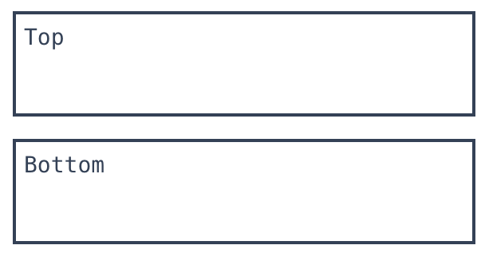
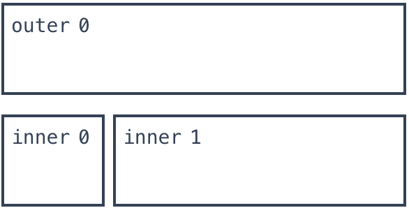

# 概述
一个专门用于制作终端用户界面 (TUI) 的 Rust
# 官网
https://ratatui.rs/
# github
https://github.com/ratatui-org
# crate
https://crates.io/crates/ratatui/
# 文档
https://ratatui.rs/introduction/
# 依赖
```
[dependencies]
ratatui = "0.27.0"
```
# 主要工作流程
```
初始化终端
循环运行应用程序,直到用户退出应用程序
将终端恢复到原始状态
```
# 概念
1. 备用屏幕 
2. 原始终端信息是主屏幕,tui主要工作在备用屏幕.
3. 备用屏幕是某些终端提供的独立缓冲区,与主屏幕不同.
4. 激活后,终端将显示备用屏幕,隐藏主屏幕的当前内容.
5. 应用程序可以像常规终端显示一样写入此屏幕,但当应用程序退出时,终端将切换回主屏幕,备用屏幕的内容将被清除.
6. 这对于希望使用完整终端窗口而不干扰命令行或其他终端内容的文本编辑器或终端游戏等应用程序非常有用.
7. 这会在应用程序和常规终端会话之间创建无缝过渡,因为启动应用程序之前显示的内容将在应用程序退出后重新出现.
# 基本工程结构
## main.rs
```rust
use std::io;

use ratatui::{
    buffer::Buffer,
    crossterm::event::{self, Event, KeyCode, KeyEvent, KeyEventKind},
    layout::{Alignment, Rect},
    style::Stylize,
    symbols::border,
    text::{Line, Text},
    widgets::{
        block::{Position, Title},
        Block, Paragraph, Widget,
    },
    Frame,
};

mod tui;

fn main() -> io::Result<()> {
    // 初始化终端,初始化备用屏幕
    let mut terminal = tui::init()?;
    // 初始化应用
    let app_result = App::default().run(&mut terminal);
    // 恢复屏幕
    tui::restore()?;
    app_result
}

/// 应用程序状态结构体
/// 里面包含了整个APP的状态成员
#[derive(Debug, Default)]
pub struct App {
    counter: u8,
    exit: bool, // true : 程序终止
}

/// 大多数应用都有一个主循环,它会一直运行,直到用户选择退出.
/// 循环的每次迭代都会通过调用绘制一帧Terminal::draw(),然后更新应用的状态.
/// 创建一个具有新运行方法impl的块App,该方法将充当应用程序的主循环：
/// 实现APP结构体,实现了操作状态成员的逻辑,用于改变APP结构的状态
impl App {
    /// 运行应用程序的主循环直到用户退出
    pub fn run(&mut self, terminal: &mut tui::Tui) -> io::Result<()> {
        /// 循环执行
        while !self.exit {
            terminal.draw(|frame| self.render_frame(frame))?;
            self.handle_events()?;
        }
        Ok(())
    }

    /// 渲染帧
    /// 处理布局
    /// frame 表示整个应用的屏幕
    fn render_frame(&self, frame: &mut Frame) {
        // frame.size() 输出所有界面帧
        frame.render_widget(self, frame.size());
    }

    /// 根据用户输入更新应用程序的状态
    /// 处理事件
    fn handle_events(&mut self) -> io::Result<()> {
        match event::read()? {
            // 检查该事件是否是按键事件非常重要,因为
            // crossterm 还在 Windows 上发出按键释放和重复事件.
            Event::Key(key_event) if key_event.kind == KeyEventKind::Press => {
                self.handle_key_event(key_event)
            }
            _ => {}
        };
        Ok(())
    }

    // 处理键盘事件
    fn handle_key_event(&mut self, key_event: KeyEvent) {
        match key_event.code {
            KeyCode::Char('q') => self.exit(),
            KeyCode::Left => self.decrement_counter(),
            KeyCode::Right => self.increment_counter(),
            _ => {}
        }
    }

    fn exit(&mut self) {
        self.exit = true;
    }

    fn increment_counter(&mut self) {
        self.counter += 1;
    }

    fn decrement_counter(&mut self) {
        self.counter -= 1;
    }
}

/// 基于 App 结构体实现了特征 Widget.
/// 要呈现 UI,应用程序需要Terminal::draw()使用接受 的闭包进行调用Frame. 
/// 上最重要的方法Frame是render_widget(),它呈现实现 Widget特征Paragraph的任何类型,例如List等.
/// 我们将为结构体实现Widget 特征App,以便将与呈现相关的代码组织在一个地方.
/// 这使我们能够Frame::render_widget()在传递给 的闭包中使用应用程序进行 调用Terminal::draw.
/// 首先,添加一个新impl Widget for &App块.
/// 我们在对 App 类型的引用上实现它,因为渲染函数不会改变任何状态,并且我们希望能够在调用 draw 之后使用该应用程序.
/// 渲染函数将创建一个带有标题、底部的说明文本和一些边框的块.在块内渲染一个Paragraph带有应用程序状态(s 计数器字段的值App)的小部件.
/// 块和段落将占据小部件的整个大小：
impl Widget for &App {
    fn render(self, area: Rect, buf: &mut Buffer) {
        let title = Title::from(" Counter App Tutorial ".bold());
        let instructions = Title::from(Line::from(vec![
            " Decrement ".into(),
            "<Left>".blue().bold(),
            " Increment ".into(),
            "<Right>".blue().bold(),
            " Quit ".into(),
            "<Q> ".blue().bold(),
        ]));
        let block = Block::bordered()
            .title(title.alignment(Alignment::Center))
            .title(
                instructions
                    .alignment(Alignment::Center)
                    .position(Position::Bottom),
            )
            .border_set(border::THICK);

        let counter_text = Text::from(vec![Line::from(vec![
            "Value: ".into(),
            self.counter.to_string().yellow(),
        ])]);

        Paragraph::new(counter_text)
            .centered()
            .block(block)
            .render(area, buf);
    }
}
```
## tui.rs
```rust
use std::io::{self, stdout, Stdout};

use ratatui::{
    backend::CrosstermBackend,
    crossterm::{
        execute,
        terminal::{disable_raw_mode, enable_raw_mode, EnterAlternateScreen, LeaveAlternateScreen},
    },
    Terminal,
};

/// 此应用程序中使用的终端类型的类型别名
pub type Tui = Terminal<CrosstermBackend<Stdout>>;

/// 初始化终端
pub fn init() -> io::Result<Tui> {
    // 将主屏幕替换成备用屏幕
    execute!(stdout(), EnterAlternateScreen)?;
    enable_raw_mode()?;
    Terminal::new(CrosstermBackend::new(stdout()))
}

/// 将终端恢复到原始状态,恢复成主屏幕
pub fn restore() -> io::Result<()> {
    execute!(stdout(), LeaveAlternateScreen)?;
    disable_raw_mode()?;
    Ok(())
}
```
# 布局设计
## 上下布局
### 构建布局
```rust
use ratatui::prelude::*;

let layout = Layout::default()
.direction(Direction::Vertical)
.constraints(vec![
   Constraint::Percentage(50),
   Constraint::Percentage(50),
]).split(frame.size());
```
### 绘制布局
```rust
frame.render_widget(Paragraph::new("Top").block(Block::new().borders(Borders::ALL)),layout[0]);
frame.render_widget(Paragraph::new("Bottom").block(Block::new().borders(Borders::ALL)),layout[1]);
```
### 示例图
 <br>
## 嵌套布局
### 构建布局
```rust
let outer_layout = Layout::default()
    .direction(Direction::Vertical) // 垂直布局
    .constraints(vec![ // 该向量有几个元素该布局就被分割成几个区域
        Constraint::Percentage(50), // 上下占位百分比
        Constraint::Percentage(50), // 上下占位百分比
    ])
    .split(f.size());

/// 基于 outer_layout 布局切割
let inner_layout = Layout::default()
    .direction(Direction::Horizontal)
    .constraints(vec![
        Constraint::Percentage(25),
        Constraint::Percentage(75),
    ])
    .split(outer_layout[1]);
```
### 绘制布局
```rust
frame.render_widget(
    Paragraph::new("outer 0")
        .block(Block::new().borders(Borders::ALL)),
    outer_layout[0]);
frame.render_widget(
    Paragraph::new("inner 0")
        .block(Block::new().borders(Borders::ALL)),
    inner_layout[0]);
frame.render_widget(
    Paragraph::new("inner 1")
        .block(Block::new().borders(Borders::ALL)),
    inner_layout[1]);
```
### 示例图
 <br>
# 常用操作
## 捕获输入字符事件
```rust
KeyCode::Char(to_insert) => {
 app.enter_char(to_insert);
}
```
## 捕获删除文本事件
```rust
KeyCode::Backspace => {
 app.delete_char();
}
```
# 部件绘制
## 普通绘制
```rust
 frame.render_widget(widget, area);
 
 // 此时组件仅需实现 Widget 特征
 ```
## 状态绘制
Ratatui 还有一个StatefulWidget.<br>
这本质上是一个可以"记住"两次绘制调用之间信息的小部件.<br>
当您拥有交互式 UI 组件(如列表)时,这至关重要,因为您可能需要记住选择了哪个项目或用户滚动了多少.<br>
```rust
frame.render_stateful_widget(
widget,
area,
&mut state,
);
 // 此时组件仅需实现 StatefulWidget 特征
```
# 自定义组件
## 基本格式
```rust
use ratatui::{buffer::Buffer, layout::Rect, style::{Color, Style}, widgets::Widget};

pub struct MyWidget {
    // Custom widget properties
    content: String,
}

impl Widget for MyWidget {
    fn render(self, area: Rect, buf: &mut Buffer) {
        // 这里写渲染逻辑
        // 方法render必须绘制到当前Buffer.
        // 有许多方法在 上实现Buffer.
        buf.set_string(area.left(), area.top(), &self.content, Style::default().fg(Color::Green));
    }
}
```
## 普通组件
```rust
use ratatui::{
    buffer::Buffer,
    layout::Rect,
    style::{Color, Style},
    widgets::Widget,
};

// 定义组件
pub struct Button {
    label: String,
    style: Style,
}

impl Button {
    pub fn new(l: String) -> Self {
        Self {
            label: l,
            style: Style::default().bg(Color::Blue),
        }
    }
}

// 组件必须实现 widget 特征
impl Widget for Button {
    fn render(self, area: Rect, buf: &mut Buffer) {
        buf.set_string(area.left(), area.top(), &self.label, self.style);
    }
}

// 绘制
frame.render_widget(Button::new("text".to_string()), frame.size());
```
## 状态组件
```rust
// 定义组件
#[derive(Default)]
pub struct TestState {
    a: u64,
}

impl TestState {
    pub fn dec(&mut self) {
        if self.a > 0 {
            self.a = self.a - 1;
        }
    }
    pub fn add(&mut self) {
        self.a = self.a + 1;
    }
}

// 定义组件
pub struct Button {
    label: String,
    style: Style,
}

impl Button {
    pub fn new(l: String) -> Self {
        Self {
            label: l,
            style: Style::default().bg(Color::Blue),
        }
    }
}

impl StatefulWidget for Button {
    type State = TestState;
    fn render(self, area: Rect, buf: &mut Buffer, state: &mut Self::State) {
        buf.set_string(
            area.left(),
            area.top(),
            format!("{}{}", self.label, (state.a).to_string()),
            self.style,
        );
    }
}

// 绘制
let mut state = TestState::default();
frame.render_stateful_widget(
Button::new("test".to_string()),
frame.size(),
&mut state,
);
```
# 异步程序设计思路
1. 在主线程中绘制ui.
2. 在子线程中处理时间以及其他耗时业务逻辑.
# 注意事项
1. 耗时数据操作只能与App对象进行交互,渲染层不能写业务逻辑