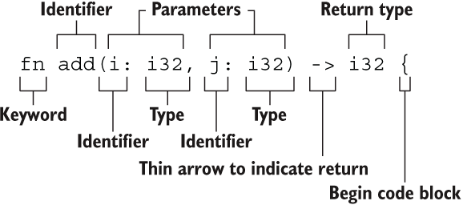

# 函数
## 函数名命名风格
rust 函数名称的命名风格是小写字母以下划线分割;
函数名和变量名使用蛇形命名法(snake case),例如 
```rust
fn add_two() -> {}
```
函数的位置可以随便放,Rust 不关心我们在哪里定义了函数,只要有定义即可
每个函数参数都需要标注类型
## 格式
```rust
fn <函数名> ( <参数 参数名:数据类型> ) -> <返回值> { 
<函数体>
<返回值> // 注意不能有分号
}
```
### 示例
```rust
fn add(i: i32, j: i32) -> i32 {
   i + j
}
```
#### 结构图
 <br>
## 基本知识
对于一些重复执行的代码,可以将其定义成一个函数,方便调用.
函数 =  函数签名 + 函数体
按值传递的参数使用 mut 关键字
```rust
fn modify(mut v: Vec<u32>) -> Vec<u32> {
    v.push(42);
    v
}
fn main() {
    let v = vec![1, 2, 3];
    let v = modify(v);
    println!("v = {:?}", v);
}
```
按引用传递参数时的 mut 的用法
```rust
fn modify(v: &mut Vec<u32>) {
    v.push(42);
}
fn main() {
    let mut v = vec![1, 2, 3];
    modify(&mut v);
    println!("v = {:?}", v);
}
```
## 函数屏蔽
变量屏蔽(variable shadow)：当声明变量绑定后,如果再次声明同名的变量绑定,则之前的变量绑定会被屏蔽. <br>
函数不能多次定义：否则报错  
```
error[E0428]: the name `xxx` is defined multiple times
```
但是,可以通过显式地使用花括号将同名的函数分割到不同的作用域中. <br>
默认的函数定义只在当前作用域内有效,会屏蔽作用域外的同名函数. <br>
### 示例
```rust
fn f() {
    println!("1");
}
fn main() {
    f(); // 2
    {
        f(); // 3
        fn f() {
            println!("3");
        }
    }
    f(); // 2
    fn f() {
        println!("2");
    }
}
```
## 函数参数模式匹配
函数中的参数等价于一个隐式的 let 绑定,而 let 绑定本事是一个模式匹配的行为.<br>
所以函数参数也支持模式匹配.<br>
### 示例
```rust
#[derive(Debug)]
struct S {
    i: i32,
}
fn f(ref s: S) {
    println!("{:p}", s); // 需要 ref 修饰
    println!("{:?}", s);
}
fn main() {
    let s = S { i: 42 };
    f(s);
    // println!("{:?}", s);
}
```
使用通配符忽略参数
```rust
fn foo(_ : i32) {
    //...
}
fn main() {
    foo(3);
}
```
Rust 中的 let 语句可以通过模式匹配解构元组 (Tuple),函数参数也可以.
```rust
// 函数利用模式匹配来解构元组
fn foo((x, y): (&str, i32)) {
    println!("x = {}", x); // x = xiaoming
    println!("y = {}", y); // y = 101
}
fn main() {
    foo(("xiaoming", 101));
}
```
## 函数返回值
Rust 中的函数只能有唯一的返回值.没有返回值的情况,实际上相当于返回了一个单元值 ().如果有多个返回值,可以使用元组类型来返回.
```rust
fn foo(x: isize, y: isize) -> (isize, isize) {
    (x + y, x - y)            // 可以使用 return 来返回.也可以不加分号,默认返回.
}
fn main() {
    let (a, b) = foo(5, 8);
    println!("a = {}, b = {}", a, b);  // a = 13, b = -3
}
```
## 泛型函数
通用类型支持
```rust
use std::ops::Mul;
fn square<T: Mul<T, Output = T>>(x: T, y: T) -> T {
    x * y
}
fn main() {
    // println!("square(3, 6) = {}", square(3, 6)); // square(3, 6) = 18
    let a = square(37.2, 41.1); // f64
    let b = square::<u32>(10, 6); // 若使用 u32,则参数不能是负数,不能是浮点数
    let c = square::<f32>(16f32, 26.3); // 指定 f32 类型
}
```
## 参数借用
借用对象到函数之外. <br>
在Rust中,可以使用生命周期（lifetimes）来确保引用的有效性超出函数的作用域.下面是一个简单的例子,展示了如何在函数外部借用一个对象.<br>
在这个例子中,borrow_object函数接受一个指向MyStruct的生命周期为'a的引用.<br>
这意味着引用可以在调用borrow_object函数的作用域之外存在,只要它所引用的MyStruct实例在那个时候仍然是有效的.<br>
在main函数中,我们创建了一个MyStruct的实例,然后借用它并调用borrow_object函数,之后我们可以在main函数中继续使用这个实例.<br>
### 示例
```rust
// 定义一个结构体
struct MyStruct {
    value: i32,
}
 
// 定义一个函数,它借用MyStruct的一个实例
fn borrow_object<'a>(_my_struct: &'a MyStruct) {
    // 在这个函数内部,我们可以使用_my_struct
    println!("Borrowed value: {}", _my_struct.value);
}
 
fn main() {
    // 创建一个MyStruct的实例
    let my_struct = MyStruct { value: 42 };
 
    // 借用my_struct并调用函数
    borrow_object(&my_struct);
 
    // 在这里,my_struct仍然是有效的,可以在函数外部继续使用
}

fn main() {
    println!("Hello, world!");
    another_function();
}
fn another_function() {
    println!("Hello, runoob!");
}

/// 输出
Hello, world!
Hello, runoob!
```
## 类型函数
是指以函数作为参数或返回值的函数. <br>
### 函数类型
#### 格式
```rust
// 声明
type MathOp = fn(i32, i32) -> i32;

// 存储
// MathOp 类型函数
fn f2(a: i32, b: i32) -> i32 {
    a + b
}
// 声明函数类型向量
let mut v:Vec<MathOp> = Vec::new();
// 函数存储到向量
v.push(f2);
// 声明函数类型map
let mut m:HashMap<String,MathOp>=HashMap::new();
// 函数存储到map
m.insert("ff".to_string(), f2);

// 调用
println!("等于:{}", m.get("ff").unwrap()(2,12));
println!("等于:{}",v.pop().unwrap()(1,2));
```
### 函数参数
函数本身可以作为参数进行传递
```rust
fn math(op: fn(i32, i32) -> i32, a: i32, b: i32) -> i32 {
    op(a, b)
}
fn sum(a: i32, b: i32) -> i32 {
    a + b
}
// 乘积 也有乘积的意思
fn product(a: i32, b: i32) -> i32 {
    a * b
}
fn main() {
    let (a, b) = (2, 3);
    println!("math(sum, a, b) = {}", math(sum, a, b)); // math(sum, a, b) = 5
    println!("math(product, a, b) = {}", math(product, a, b)); // math(product, a, b) = 6
}
```
实现上述功能的基础在于 Rust 支持函数指针.
函数指针,是指向函数的指针,其值为函数的地址
```rust
fn hello() {
    println!("hello function pointer");
}
fn main() {
    // fn_ptr 是函数指针类型 (Fn-Pointer Type),可以打印指针地址
    let fn_ptr: fn() = hello;                
    println!("fn_ptr = {:p}", fn_ptr);
    // other_fn 的实际类型是 fn() {hello},这实际是 函数类型(Fn-Item Type)
    let other_fn = hello;
    // println!("other_fn = {:p}", other_fn);  // 非函数指针,这样会报错
    hello();
    other_fn();
    fn_ptr();
    (fn_ptr)()
}
```
### 可读性
对于函数指针类型,使用 type 关键字定义别名,能提升代码的可读性
```rust
type MathOp = fn(i32, i32) -> i32;

fn math(op: MathOp, a: i32, b: i32) -> i32 {
    println!("{:p}", op);
    op(a, b)
}
```
### 函数返回值
将函数作为返回值
```rust
// 声明一个函数变量,形参1:i32,形参2:i32,返回值:i32
type MathOp = fn(i32, i32) -> i32;

fn math(op: &str) -> MathOp {
    // 与 MathOp 格式一致
    fn sum(a: i32, b: i32) -> i32 {
        a + b
    }
    // 乘积 也有乘积的意思
    // 与 MathOp 格式一致
    fn product(a: i32, b: i32) -> i32 {
        a * b
    }
    match op {
        "sum" => sum,
        "product" => product,
        _ => panic!("unknown method name: {}", op),
    }
}

fn main() {
    let (a, b) = (2, 6);
    let sum = math("sum");
    let product = math("product");
    println!("sum({}, {}) = {}", a, b, sum(a, b));
    println!("product({}, {}) = {}", a, b, product(a, b));
    let div = math("div"); // panic
}
```
### 注意点
Rust 不允许 返回的 fn 函数捕捉外部环境变量,若有需要,可以使用闭包来代替.
```rust
type MathOp = fn(i32, i32) -> i32;

fn math(out_num: i32) -> MathOp {
    fn sum(a: i32, b: i32) -> i32 {
        a + b + out_num  //  can't capture dynamic environment in a fn item. help: use the `|| { ... }` closure form instead
    }
    return sum;
}
```
## 类型约束
如果一个函数，有多个参数，而这些参数，分别需要约束它们去实现不同的trait.
### 格式
```rust
fn render<T: Component + Other, E: Trait1 + Trait2>(t: &T, e: &E) {
    // code....
}
```
### 示例
```rust
fn fn_name<T, E>(t: &T, e: &E) -> String
    where T: Component + Other,
          E: Trait1 + Trait2
{
//     函数体代码
}

// or

impl <A: TraitB + TraitC, D: TraitE + TraitF> MyTrait<A, D> for YourType {}

// 使用 `where` 从句来表达约束
impl <A, D> MyTrait<A, D> for YourType where
    A: TraitB + TraitC,
    D: TraitE + TraitF {}
```
## 函数表达式
Rust 中可以在一个用 {} 包括的块里编写一个较为复杂的表达式：
### 示例
```rust
fn main() {
    let x = 5;

    let y = {
        let x = 3;
        x + 1 // 表达式返回值
    };
    println!("x : {}", x);
    println!("y : {}", y);
}
```
## 函数嵌套定义
这种表达式块是一个合法的函数体。
### 示例
```rust
fn main() {
    fn five() -> i32 {
        5
    }
    println!("five() : {}", five());
}
```
## 方法与函数
Rust 中的方法和函数是有区别的。
### 关联
```
都使用 fn 关键字声明
都有参数和返回值
都可以被调用
```
### 区别
```
方法代表某个实例对象的行为，必须关联一个方法接受者，然后使用名字来进行调用。
函数只是一段简单的代码，它可以通过名字来进行调用。
方法的第一个参数永远是 self ，表示被调用的方法作用的实例（instance）
方法通常被定义在一个结构体、枚举或者 对象的上下文（context）下，而函数通常没有具体的上下文
Rust 使用方法的原因是提高代码的组织性。impl 紧紧关联着作用的结构体。
```