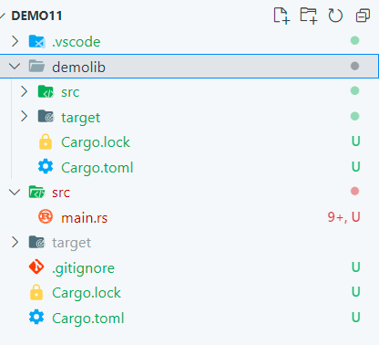
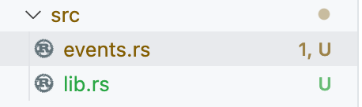

# 根目录开始查找
```rust
use crate;
```
# 从父目录开始查找
```rust
use super
```
# main 同级目录下不同文件(模块)互相调用
```rust
src/a.rs
// 导入同级b模块
use crate::b::b;
//or
use super::b::b;
// 私有字段
#[allow(dead_code)]
pub struct ClosedBox {
    contents: i64,
    contents2: Option<i64>,
}

impl ClosedBox {
    // 公开的构造方法
    pub fn new(contents: i64) -> ClosedBox {
        ClosedBox {
            contents: contents,
            contents2: Some(8989889),
        }
    }
    pub fn set(&mut self) {
        self.contents2 = Some(123);
    }
    pub fn a(&self) -> i64 {
        b();
        self.contents2.unwrap()
    }
}


src/b.rs
pub fn b(){
    println!("123123");
}

src/main.rs
mod a; // 声明a模块
mod b; // 声明b模块
use a::ClosedBox; // 导入a模块下结构体
fn main() {
    // 通过构造方法创建
    let mut _closed_box = ClosedBox::new(123);
    //_closed_box.set();
    println!("1--{}",_closed_box.a());
}
```
# main查找同目录下文件
```rust
src/c.rs
src/d.rs
src/main.rs
```
## 调用
```rust
mod d;
mod c;
use d::a;
use c::c;

fn main() {
   //....
}
```
# 同一根目录,不同文件夹(模块)
```rust
文件夹一
其他文件夹/mod.rs // 在该文件中声明模块
文件夹二
use crate::其他文件夹::模块::函数或结构体;
```
## mod.rs 文件
```rust
pub mod m;
```
# 多层嵌套文件夹模块声明
每个文件夹要成为模块,必须要用 mod.rs 文件声明
层级关系
```rust
/// 模块一
src/a/b/mod.rs
```
```rust
/// 模块二
src/a/c/mod.rs
```
最外层导出所有模块
```rust
src/a/mod.rs

/// 文件内容
pub mod a
pub mod b
```
# 不同根目录,调用其他根目录
```rust
// 模块一
a/src/a.rs
a/src/mod.rs
mod a
// 模块二
b/src/b.rs
b/src/mod.rs
mod b
```
```rust
use 其他根目录名::{
    模块::模块::函数或结构体
};
//b 模块中的 b.rs 文件导入 a
use a::{
    a::func_a
}
```
# 本地库引入
##  目录结构

## demolib cargo.toml
```rust
[package]
name = "demolib"
version = "0.1.0"
edition = "2021"
```
## 根 cargo.toml
```rust
[dependencies]
demolib = {path="demolib"}
```

## lib.rs
```rust
pub mod events; // 必须和文件名一致
```
## main
```rust
extern crate demolib;

use demolib::add;

fn main() {
 
}
```
## 本地相对路径
```rust
[dependencies]
sync_fs={path="../../GitProject/sync-fs"}
```
## 本地绝对路径
```rust
[dependencies]
aptos-light-sdk = {path = "/Users/max/GitProject/aptos-light-sdk"}
```
# 当前模块
```rust
use self::函数或结构体;
```