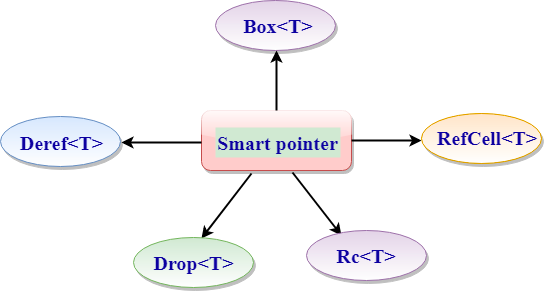

# 概述
智能指针是一种数据结构,其行为类似于指针,同时提供内存管理或绑定检查等附加功能. <br>
智能指针可跟踪其指向的内存,还可用于管理其他资源,如Fils句柄和网络连接. <br>
智能指针最初用于C++语言. <br>
引用也是一种指针,但除了引用数据之外,它没有其他功能. <br>
引用由&运算符表示. <br>
智能指针提供的功能超出了参考提供的功能.  <br>
智能指针提供的最常见功能是"引用计数智能指针类型". <br>
 此功能能够通过跟踪所有者来拥有多个数据所有者,如果没有所有者,则可以清除数据. <br>
引用是仅借用数据的指针,而智能指针是拥有它们指向的数据的指针. <br>
Box 允许将一个值放在堆上而不是栈上,留在栈上的则是指向堆数据的指针. <br>
Box 是一个指向堆的智能指针,当一个 Box 超出作用域时,它的析构函数被调用,内部对象被销毁,堆上的内存被释放. <br>
Box 没有运行上的性能损失,虽然如此,但它却只在以下场景中比起默认的栈上分配更适用：
```
当有一个在编译时未知大小的类型,而又想要在需要确切大小的上下文中使用这个类型值的时候
当有大量数据并希望在确保数据不被拷贝的情况下转移所有权的时候
当希望拥有一个值并只关心它的类型是否实现了特定 trait 而不是其具体类型的时候
```
# 类型
 <br>
## Box <T>
Box <T>是一个智能指针,指向在类型为T的堆上分配的数据,其中"T"是数据的类型. 
它用于将数据存储在堆上而不是堆栈上. 
## Deref <T>
Deref <T>是一个智能指针,用于自定义解除引用运算符(*)的行为. 
## Drop <T>
Drop <T>是一个智能指针,用于在变量超出范围时从堆内存中释放空间. 
## Rc <T>
Rc <T>代表参考计数指针. 
它是一个智能指针,用于记录存储在堆上的值的引用数. 
RefCell <T>
RefCell <T>是一个智能指针,允许借用可变数据,即使数据是不可变的. 
这个过程被称为内部可变性. 