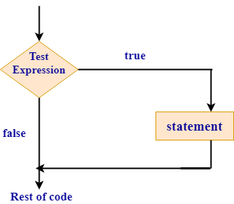
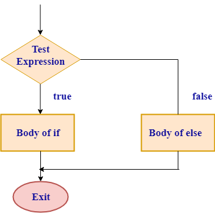
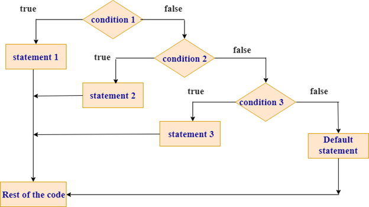
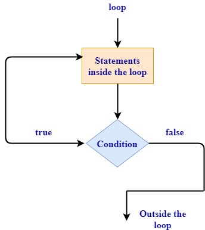
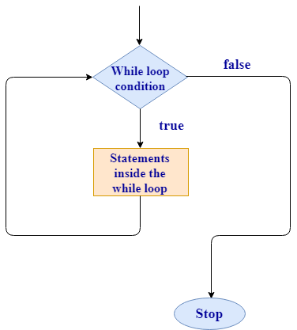

# 基础语法
## 条件语句
if语句确定条件是否为真.如果条件为true,则执行if块,否则,控制会跳过if块.
表示if块的几种方式:
```rust
if 块
if-else 块
if else-if 阶梯块
嵌套if语句
```
### if语句
#### 语法
```rust
if condition  
{  
    //block statements;  
}
```
在上面的语法中,如果条件为真,则执行块语句,否则跳过if块.
#### 流程图

#### 示例
下面来看一个if语句的简单例子.
```rust
fn main(){

 let a=1;  
 if a==1  
 {  
      println!("a is equal to 1");  
 }
}

执行上面示例代码,得到以下结果:
a is equal to 1
```
在这个例子中,a的值等于1. <br>
因此,if中给出的条件为真,并且字符串作为参数传递给println! 显示在控制台上. <br>
### if-else语句
如果条件为真,则执行if块并跳过else块内的语句.如果条件为假,则跳过if块内的语句执行else块中的语句.
#### 语法
```rust
if condition  
{  
   //block statements  
}else{  
    //block statements  
}
```
#### 流程图

#### 示例
```rust
fn main()  
{  
  let a=3;  
  let b=4;  
  if a>b  
  {  
     println!("a is greater than b");  
  }  
  else  
   {  
     println!("a is smaller than b");   
   }  
}
执行上面示例代码,得到以下结果 - 
a is smaller than b
```
在该示例中,变量a的值等于3并且a的值小于b的值. 因此,执行else块并在屏幕上打印"a is smaller than b".
### else-if语句
如果要检查多个条件,则可使用else-if语句.
#### 语法
```rust
if condition 1  
{  
  //block statements  
}else if condition 2  
{  
  //block statements  
}   
.  
.  
else{  
//block statements  
}
```
在上面的语法中,Rust为第一个真实条件执行块,当匹配到第一个真条件时,它就不会执行其余的块.

#### 示例
```rust
fn main(){

 let num= -5;  
 if num>0  
 {  
   println!("number is greater than 0");  
 }  
 else if num<0  
 {  
   println!("number is less than 0 ");  
 }  
 else  
 {  
   println!("number is not equal to 0");  
 }
}
执行上面示例代码,得到以下结果 - number is less than 0
```
在此示例中,变量num的值等于-5且num小于0.因此,else if块执行.
### 嵌套if-else语句
当if-else语句出现在另一个if或else块的主体内时,它称为嵌套if-else.
#### 语法 
```rust
if condition 1  
{  
   // 嵌套if/else块  
   if condition 2  
    {  
         //block statements  
    }else  
    {  
        //block statements  
    }  
}else{  
   //block statements  
}
```
#### 示例
下面来看一个嵌套if-else的简单示例 - 
```rust
fn main(){

 let a=5;  
 let b=6;  
 if a!=b  
 {  
   if a>b  
   {  
     println!("a is greater than b");  
   }else{  
      println!("a is less than b");  
   }  
 }  

 else  
 {  
      println!("a is equal to b");  
 }
}

执行上面示例代码,得到以下结果 - a is less than b
```
在此示例中,a的值不等于b. 因此,控制进入if块并且a的值小于b. <br>
因此,执行else块,该块存在于if块内. <br>
### if in a let 语句
在let语句的右侧使用if表达式,并将if表达式的值赋给let语句.
#### 语法
```rust
Let variable_name = if condition{  
 //code blocks  
}else{  
 //code block  
}
```
在上面的语法中,如果条件为真,则将if表达式的值赋给变量,如果条件为false,则将else的值赋给变量.
#### 示例
```rust
fn main(){

 let a = if true  
       {  
          1  
       }  
       else  
       {  
           2  
       };  
 println!("value of a is: {}", a);
}
执行上面示例代码,得到以下结果 - value of a is: 1
```
在此示例中,条件为真. 因此,a变量与if表达式的值绑定.现在,a的值是1.
## 循环语句
### loop循环
一种重复执行且永远不会结束的循环.
如果想要多次执行语句块,那么循环概念就属于这个角色.
循环执行循环体内存在的代码直到结束,并从启动开始立即重新开始.
loop不是条件循环. 
它是一个关键字,告诉Rust一次又一次地执行代码块,直到除非明确地手动停止循环.
loop循环
```rust
loop{  
  //block statements  
}
```
在上面的语法中,块语句被无限次执行.
loop循环流程图

#### 示例
```rust
fn main(){
     loop  
     {  
         println!("Hello Yiibai");  
    }
}

执行上面示例代码,得到以下结果 - 
Hello Yiibai
Hello Yiibai
Hello Yiibai
Hello Yiibai
.
.
.
infinite times
```
在这个例子中,"Hello Yiibai"字符串一遍又一遍地打印,直到除非手动停止循环.通常,"ctrl + c"命令用于从循环终止.
#### 循环终止
break关键字用于从循环终止. <br>
如果未使用break关键字,则循环将无限次执行. <br>
```rust
fn main()  
 let mut i=1;  
 loop  
 {
       println!("Hello Yiibai");  
       if i==7   
       {  
         break;  
       }  
     i+=1;  
 }
}
执行上面示例代码,得到以下结果 - 
Hello Yiibai
Hello Yiibai
Hello Yiibai
Hello Yiibai
Hello Yiibai
Hello Yiibai
Hello Yiibai
```
在上面的例子中,i是一个计数器变量,它是一个可变变量,表示可以改变计数器变量以备将来使用.
### for循环
#### 语法一
```rust
for var in expression(表达式)
{  
    //block statements  
}

// 案例
for i in 1..11  
{  
    print!("{} ",i);  
}   
// 输出
1 2 3 4 5 6 7 8 9 10
```
#### 语法二
```rust
fn main(){
 let fruits=["mango","apple","banana","litchi","watermelon"];  
 for a in fruits.iter()  
 {  
   print!("{} ",a);  
 }
}

//输出
mango apple banana litchi watermelon
```
#### while循环和for循环的区别
如果数组的索引长度在运行时增加,那么while循环显示错误,但在for循环的情况下不会发生这种情况. <br>
因此,可以说for循环增加了代码的安全性并消除了错误的可能性. <br>
### while循环
while-loop是一个条件循环.当程序需要评估条件时,则使用条件循环. 当条件为真时,它执行循环,否则它终止循环.
一种在某些条件为真的情况下就会永远执行下去的循环.
#### 语法
```rust
while 条件
//block statements;
```
在上面的语法中,while循环评估条件. 如果条件为真,则执行块语句,否则终止循环. Rust提供了这个内置构造,可以与loop,if,else或break语句结合使用.
while循环流程图

#### 示例
```rust
 fn main()  
{  
  let mut i=1;  
  while i<=10  
    {  
       print!("{}", i);  
       print!(" ");  
       i=i+1;  
    }  
}

执行上面示例代码,得到以下输出结果 - 1 2 3 4 5 6 7 8 9 10
```
在上面的例子中,i是一个可变变量,意味着可以修改i的值. while循环执行直到i的值小于10或等于10.
#### while循环的缺点
如果索引长度不正确,循环可能会导致问题. <br>
当编译器添加运行时代码以通过此循环对每次迭代执行条件检查时,它也很慢. <br>
## 流程控制
一般语言的常见的流程控制结构类型有:顺序结构、条件结构、循环结构,rust 还有强大的 匹配结构.
### 条件表达式
条件表达式可以用于基本的条件语句,也可结合 let,使用 let xx = if cnd 作为 三元运算符,实现 cnd ? value1 : value2; 的功能
```rust
fn main() {
    let a = 12;
    let b = if a >= 0 && a <= 10 {
        a * 2
    } else {
        a / 2
    };
    println!("b = {}", b);
}
```
### 循环表达式
三种循环表达式:for...in , while , loop .
```rust
for i in 1..=3 {
    println!("i = {}", i);
}


let mut i = 1;
while i <= 3 {
    println!("i = {}", i);
    i += 1;
}


let mut i = 1;
loop {
    if i > 3 {   // 符合条件则退出
        break;
    }
    println!("i = {}", i);
    i += 1;
}
```
### match 表达式
```rust
fn main() {
    let number = 10;
    match number {
        0 => println!("This is zero"),
        1..=3 => println!("From 1 to 3"),
        5 | 7 | 13 => println!("Good luck,"),
        n @ 42..=50 => println!("Answer is {}", n),
        _ => println!("Not matched!"),
    }
}
```
match 模式匹配,还可以解构:元组,枚举,指针和引用,结构体.
### if let 和 while let 表达式
```rust
// if let 相关样例
fn main() {
    // 不使用 if let 的情形
    let number = Some(7);
    match number {
        Some(i) => println!("option number is: {}", i),
        _ => {}
    }

    // 使用 if let 的情形
    let number = Some(10);
    if let Some(i) = number {
        println!("option number is: {}", i);
    }

    // if let 像普通的 if 一样,可以随意接续 else 或 else if
    let number: Option<i32> = None; // 必须指定类型,否则无法匹配 Some(i),因为 i 需要类型
    if let Some(i) = number {
        println!("option number is: {}", i);
    } else if 3 > 5 {
        println!("3 is bigger than 5");
    } else {
        println!("donot deal this");
    }
}

// while let 相关样例
fn main() {
    // 不使用 while let
    let mut v = vec![1, 2, 3, 4, 5];
    loop {
        match v.pop() {
            Some(i) => println!("style1: i = {}", i),
            None => break,
        }
    }

    // 使用 while let
    v = vec![1, 2, 3, 4, 5];
    while let Some(i) = v.pop() {
        println!("style2: i = {}", i);
    }
}
```
### 标签
外循环可以使用break或continue,当在处理嵌套循环时.
在这种情况, 循环必须用一些被注解:
'label, 标签必须被传递给 break/continue语句.
#### 格式
```rust
'标签名称:{
    // .... 被标记代码块
}
```
#### 案例
```rust
#![allow(unreachable_code)]

fn main() {

    'outer: loop {

        println!("Entered the outer loop");

        'inner: loop {

            println!("Entered the inner loop"); 

            break 'outer;

        }

        println!("This point will never be reached");

    }

    println!("Exited the outer loop");

}
```
### 范围表达
#### 语法
```rust
start...end : 不包含end
start...=end : 包含end
```
# 关键字
```rust
as:类型转换；
async:声明异步函数；
await:等待异步操作结果；
break:结束循环或跳出循环语句块；
const:声明常量；
continue:继续下一轮循环；
crate:当前 crate 的名称；
dyn:动态分发 trait；
else:条件不成立时执行的语句；
enum:声明枚举类型；
extern:链接外部库；
false:布尔值 false；
fn:声明函数；
for:循环语句；
if:条件语句；
impl:为类型(类型别名)实现 trait 或方法；
in:for 循环中使用,表示一个迭代器,把集合中的元素逐个取出；
let:声明变量；
loop:无限循环；
match:模式匹配；
mod:创建和使用 rust 模块；
move:将值转移到闭包中；
mut:声明可变变量；
pub:将定义的变量或函数设为公有的；
ref:引用类型；
return:从函数中返回；
Self:表示当前类型；
self:表示当前实例；
static:声明静态变量；
struct:声明结构体类型；
super:表示父模块；
trait:声明 trait 类型；
true:布尔值 true；
type:定义类型别名；
union:声明共用体类型；
unsafe:标记不安全代码块；
use:引入 crate 或模块中的路径；
where:为泛型约束添加限制；
while:循环语句.
```
# 表达式
## 字面量表达式
```rust
"hello";   // 字符串类型
'5';       // 字符类型
5;         // 整型
```
# 操作符重载
在 Rust 语言中,许多运算符(Operators)都能通过接口(Traits)重载.<br>
这是因为运算符只是方法调用的语法糖. 例如,a + b 被当作 a.add(&b) 处理.<br>
这里的 add 方法是接口 Add 的一部分,所有 Add 接口的实现者都能使用 + 运算符.<br>
## 案例
```rust
struct Foo;
struct Bar;

#[deriving(Show)]
struct FooBar;

#[deriving(Show)]
struct BarFoo;

// The `Add<T, U>` trait needs two generic parameters:
// * T is the type of the RHS summand, and
// * U is the type of the sum
// This block implements the operation: Foo + Bar = FooBar
impl Add<Bar, FooBar> for Foo {
    fn add(self, _rhs: Bar) -> FooBar {
        println!("> Foo.add(&Bar) was called");

        FooBar
    }
}

// Addition can be implemented in a non-commutative way
// This block implements the operation: Bar + Foo = BarFoo
impl Add<Foo, BarFoo> for Bar {
    fn add(self, _rhs: Foo) -> BarFoo {
        println!("> Bar.add(&Foo) was called");

        BarFoo
    }
}

fn main() {
    println!("Foo + Bar = {}", Foo + Bar);
    println!("Bar + Foo = {}", Bar + Foo);
}
```
# 匹配器
## 概述
Rust 通过match关键字提供模式匹配,可以像 C 一样使用switch.
评估第一个匹配臂并且必须覆盖所有可能的值.<br>
Rust 使用 match 关键字来进行模式匹配,有点像 C 语言中的 switch.所有可能的分支都需要被覆盖,只会匹配到第一个满足条件的.<br>
了解了 Rust 中的 match 关键字,用来进行模式匹配,和其它语言的 switch 类似.
多个条件从上到下都会进行匹配,联合过滤. <br>
## 比较步骤
```rust
match先比较类型, 然后deref之后, 再比较值, 一共三个步骤.
```
## 匹配单个值
```rust
fn main() {
    let number = 1;
    match number {
        // 匹配单个值
        1 => println!("One!"),
        // 要覆盖所有的可能分支,不然有编译错误
        // 对非枚举类进行分支选择时必须注意处理例外情况,即使在例外情况下没有任何要做的事 . 例外情况用下划线 _ 表示
        _ => println!("Ain't special"),
    }
}
```
## 匹配多个值
```rust
fn main() {
    let number = 7;
    match number {
        // 匹配多个值
        2 | 3 | 5 | 7 | 11 => println!("This is a prime"),
        // 要覆盖所有的可能分支,不然有编译错误
        _ => println!("Ain't special"),
    }
}
```
## 匹配区间
```rust
fn main() {
    let number = 13;
    match number {
        // 匹配区间
        13..=19 => println!("A teen"),
        // 要覆盖所有的可能分支,不然有编译错误
        _ => println!("Ain't special"),
    }
}
```
## 首个匹配
```rust
fn main() {
    let number = 13;
    match number {
        // 只有第一个匹配的才会执行,后面的不会
        7 | 11 | 13 => println!("This is a prime"),
        13..=19 => println!("A teen"),
        _ => println!("Ain't special"),
    }
}
```
## 返回值
```rust
fn main() {
    let boolean = true;
    // match 是一个表达式,也可以返回值
    let binary = match boolean {
        false => 0,
        true => 1,
    };
    println!("{} -> {}", boolean, binary);
}
```
## 字符串匹配
&str 与 String 进行比较
```rust
let head_items: Vec<&str> = c.split(":").collect();
match head_items[0] {
_ if head_items[0] == "Host" => println!("aaaa."),
_ => println!("nothing")
}
```
# 过滤器
```rust
match mode {
    BalancingMode::WEIGHT => Proxy::to(host, port, request).await,
    BalancingMode::RANDOM => Proxy::to(host, port, request).await,
    BalancingMode::POLLING => Proxy::to(host, port, request).await,
    _ => Err("".to_string()),
}
// or
match mode {
    BalancingMode::WEIGHT => {
    Proxy::to(host, port, request).await
    }
    BalancingMode::RANDOM => {Proxy::to(host, port, request).await}
    BalancingMode::POLLING => {Proxy::to(host, port, request).await}
    _ => Err("".to_string()),
}
```
# 变量
## 概述
变量,基本类型,函数,注释和控制流,这些几乎是每种编程语言都具有的编程概念.<br>
这些基础概念将存在于每个 Rust 程序中,及早学习它们将使你以最快的速度学习 Rust 的使用.<br>
## 创建变量
### 格式一
```rust
let 变量名 = 初始化值
// 或
let 变量名
变量名 = 1213
```
### 格式二
```rust
let 变量名: 数据类型;
变量名 = 1213
// 或
let 变量名: 数据类型 = 1213;
```
### 示例
```rust
let x; // declare "x"
x = 42; // assign 42 to "x"
let x = 42;

let x: i32; // `i32` is a signed 32-bit integer
x = 42;
let x: i32 = 42;
```
# 常量
## 格式
```rust
const VARIABLE_NAME:dataType = value;
```
## 字符串常量
字符串常量(String Literals)采用 Unicode 编码(注:下文提及的 utf-8 为 Unicode 的一部分).
### 格式
```rust
&'static str
```
### 格式解释
& 意味着该变量为对内存中数据的引用,没有使用 &mut 代表编译器将不会允许对该变量的修改. <br>
'static 意味着字符串数据将会一直保存到程序结束（它不会在程序运行期间被释放（drop）） <br>
str 意味着该变量总是指向一串合法的 utf-8 字节序列. <br>
### 内存细节
Rust 编译器可能会将字符串储存在程序内存的数据段中.
```rust
let a: &'static str = "你好 🦀";
// or
const DEMO: &'static str = "demo";
// or
/// server listening address
pub const SERVER_LISTENING_ADDR: &'static str = "0.0.0.0";
```
# 静态变量
## 可变静态变量
```rust
pub static mut EVENT_COUNTER: u32 = 0;
// 必须在 unsafe 中修改
unsafe {
   EVENT_COUNTER = 2；
}
// 必须在 unsafe 中使用
if unsafe { NET_PACKAGE_EVENT_SWITCH } == 2 {}
```
## 不可变静态变量
```rust
pub const NET_PACKAGE_EVENT: &'static str = "NET_PACKAGE_EVENT";
```
## 运行时可变静态变量
### lazy_static 依赖
```rust
/// 依赖
lazy_static = "1.5.0"

use std::{collections::HashMap, sync::Mutex};
/// global event pool
/// 全局静态可变变量
lazy_static! {
    pub static ref EVENT_POOL: Mutex<HashMap<String, Event>> = {
        let mut map = HashMap::new();
        Mutex::new(map)
    };
}

/// 修改值
// 读
SERVER_LISTENING_PORT.lock().unwrap()
// 写
SERVER_LISTENING_PORT.lock().unwrap().函数
// 替换
SERVER_LISTENING_PORT.lock().unwrap().clone_from(&String::from_str("18181").unwrap());
```
# 字面量
## 转义字符
```rust
\n : 换行符
\r : 回车符（回到本行起始位置）
\t : 水平制表符（即键盘 Tab 键）
\\ : 代表单个反斜杠 \
\0 : 空字符（null）
\' : 代表单引号 '
\" : 双引号 "
```
## 数字
```rust
十进制整数 : 98_222
十六进制整数 : 0xff
八进制整数 : 0o77
二进制整数 : 0b1111_0000
浮点 : 123.0E+77
```
## 字符与字符串
```rust
Character : 'H'

String : "hello"

Raw string : r#"hello"# 在Rust中,如果需要使用Rust关键字作为变量名、函数名、模块名等标识符,可以在关键字前面加上前缀r#,这样编译器就会将其解析为标识符而非关键字.这个前缀可以用于任何Rust关键字.例如:let r#return = 123;println!("{}",r#return);

Byte : b'H'

Byte string : b"hello"

Raw byte string : br#"hello"#
```